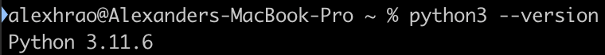

# An Introduction to Programming

## Why programming?

* Lazy! Why do something if you can manage not to
* Manual steps introduce error. Better if it is built once and then same forever
* Repetitive tasks detract from what you’re actually paid to do
* Beware though: 

## What we'll be learning

By the end of this course, you'll walk away knowing how to do the following:

* Understand plain text, CSV, and JSON
* Read Python code written by someone else
* Use Python to read and write files
* Use Python to combine multiple CSV files
* Use Python to reach out to a website to extract data
* Solve silly puzzles about Elves with Python
* Understand the basics of Version Control (VC) and why it's useful
* Understand the basics of debugging, and what to do when your code doesn't work
* Read and write **Markdown**, a text-based markup language

## Text and Text Editors
Most of the docs you use are what’s called “rich text”. This is text that can be styled. Bold, italic, but other things like links. You can have images, tables, a whole bunch of stuff. These are things like word docs

From now on we’re dealing with what’s called plain text. If you have ever seen a file ending in txt, that’s what this is. It’s nothing but the actual text. It turns out that code is actually just plain text, but usually with a different extension! We're learning python, so 

You don’t edit these things with Word or google docs. You use something called a “text editor”. These applications are tailored to editing just text

The de facto standard is called Visual Studio Code (**VSC**), which you’re already familiar with! Just as a refresher, you'll want to open a new VSC window, `File > New Text File`, then when you save it, save it as `code.py`. VSC is nice in that once it knows you're typing Python, it has what's called "intellisense"; it'll try its best to autocomplete your code! This is a game changer and supercharges productivity.

## Terminal
Often you interact with the computer by clicking, typing, etc. applications give dialogs that ask you things, usually in a pretty text box or something. This is great but it adds a lot of steps, and it makes it really hard to automate stuff. Given that the whole point of programming is to make a computer do things that are repetitive, it would be really nice to have a way of giving a computer commands that we can easily repeat later on.
That’s what a Terminal does. It provides a way to interact with your computer without any user interface; you give it textual commands, and it (usually) gives you textual responses

Terminals are technically speaking a Linux/Mac thing - Windows, until recently, didn’t have one. But what Windows has had for awhile now is the Command Prompt. That being said, we’ll be using the Windows Terminal. On your Mac, it’s just called “Terminal”

For example, in this command we're asking the app called `python3` what version it is:



You can get super complicated here, but for our purposes you really only need to know how to invoke Python. Suppose you have code in a file called `code.py`, to run it, just open a terminal (In VSC, go to `View > Terminal`), and then run:

``` sh
python3 code.py
```

